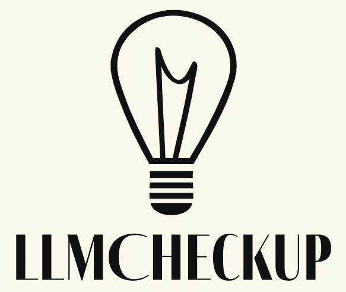
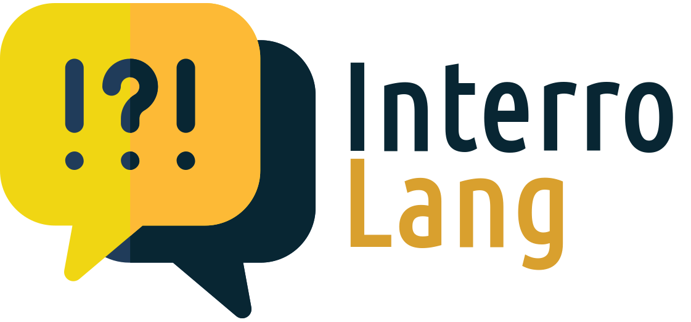

 |  |  |  | 

Hi👋, I'm Qianli Wang and work as a NLP researcher dedicated to advancing the interpretability and explainability of LLMs. My passion lies in unraveling the complexities of these models to make their inner workings more transparent and their outputs more trustworthy.

 
 
 

# ✨ News
<u><b>2024-07-12</b></u> | One co-authored paper - _Towards Modeling and Evaluating Instructional Explanations in Teacher-Student Dialogues_ accepted to ACM GoodIT.

<u><b>2024-06-12</b></u>: One new paper in submission: A question answering (resource) paper on the conversational parsing explanation requests (CoXQL).

<u><b>2024-04-19</b></u>: _LLMCheckup: Conversational Examination of Large Language Models via Interpretability Tools and Self-Explanations_ accepted to NAACL 2024 HCI+NLP workshop🛕!

<u><b>2024-02-28</b></u>: Two new papers in submission: A follow-up to InterroLang on the conversational examination of self-explaining LLMs (LLMCheckup) and a resource and evaluation paper on instructional explanations in teacher-student dialogues (ReWIRED).

<u><b>2023-10-08</b></u>: _InterroLang: Exploring NLP Models and Datasets through Dialogue-based Explanations_ accepted to EMNLP 2023 Findings🦁!

# 🧑‍🎓 Education Background
2024-ongoing: Computer Science, PhD, Technische Universität Berlin. Supervised by [Prof. Dr. Sebastian Möller](https://www.tu.berlin/qu/ueber-uns/leitung).

2021-2023: Computer Science, M.Sc., Technische Universität Berlin. Supervised by [Nils Feldhus](https://www.dfki.de/web/ueber-uns/mitarbeiter/person/nife02) and [Dr.-Ing. Leonhard Hennig](https://www.dfki.de/web/ueber-uns/mitarbeiter/person/lehe02): _A Singular LLM is all you need for dialogue-based explanation regarding NLP tasks_.

2018-2021: Computer Science, B.Sc., Freie Universität Berlin. Supervised by [Prof. Dr. László Kozma](https://www.mi.fu-berlin.de/inf/groups/ag-ti/members/professoren/Kozma_Laszlo.html): _Understanding and implementation of the algorithm for three-coloring in triangle-free planar graphs_. 

# 🧑‍💻 Jobs
2024.07 - ongoing: **NLP Researcher** @ [Quality and Usability Lab](https://www.tu.berlin/qu), Technische Universität Berlin, Berlin, Germany; funded by VERANDA project.

2024.02 - ongoing: **Guest Researcher** @ German Research Center for Artificial Intelligence (DFKI) - [SLT Group](https://www.dfki.de/en/web/research/research-departments/speech-and-language-technology/), Berlin, Germany.

2023.01 - 2024.01: **Research Assistant** @ German Research Center for Artificial Intelligence (DFKI) - [SLT Group](https://www.dfki.de/en/web/research/research-departments/speech-and-language-technology/), Berlin, Germany.

# 📑 Publication
## 2024
Towards Modeling and Evaluating Instructional Explanations in Teacher-Student Dialogues

Nils Feldhus, Aliki Anagnostopoulou, **Qianli Wang**, Milad Alshomary, Henning Wachsmuth, Daniel Sonntag, and Sebastian Möller

ACM GoodIT 2024 (Work in Progress track)

[OpenReview (previous ARR submission)](https://openreview.net/forum?id=mHgNzfiApQ) | Proceedings available in September

 

CoXQL: A Dataset for Parsing Explanation Requests in Conversational XAI Systems

**Qianli Wang**, Tatiana Anikina, Nils Feldhus, Simon Ostermann, and Sebastian Möller

_In submission_

[arXiv](https://arxiv.org/abs/2406.08101) | [GitHub](https://github.com/DFKI-NLP/CoXQL)

 

LLMCheckup: Conversational Examination of Large Language Models via Interpretability Tools and Self-Explanations

**Qianli Wang**, Tatiana Anikina, Nils Feldhus, Josef van Genabith, Leonhard Hennig, and Sebastian Möller

_NAACL 2024 Workshop on Bridging Human-Computer Interaction and Natural Language Processing (HCI+NLP)_

[ACL Anthology](https://aclanthology.org/2024.hcinlp-1.9/) | [arXiv](https://arxiv.org/abs/2401.12576) | [GitHub](https://github.com/DFKI-NLP/LLMCheckup)

 

## 2023

InterroLang: Exploring NLP Models and Datasets through Dialogue-based Explanations

Nils Feldhus, **Qianli Wang**, Tatiana Anikina, Sahil Chopra, Cennet Oguz, and Sebastian Möller

_EMNLP 2023 Findings_

[ACL Anthology](https://aclanthology.org/2023.findings-emnlp.359/) | [arXiv](https://arxiv.org/abs/2310.05592) | [GitHub](https://github.com/DFKI-NLP/InterroLang/)

## 🐾 Academic Service
### Conference Reviewer

### Secondary Reviewer
#### Interpretability and Analysis Models for NLP track
- EACL 2024
- EMNLP 2023
- ACL 2023 
- EACL 2023 

### Workshop Reviewer
BlackboxNLP @ EMNLP 2023 (secondary)